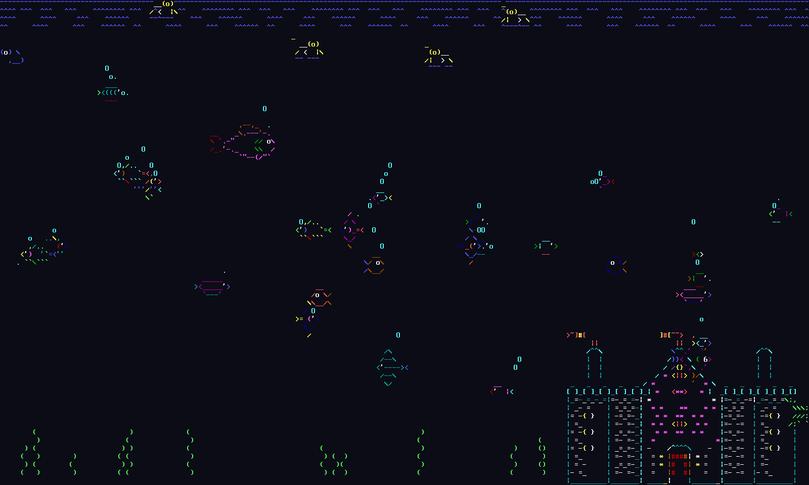
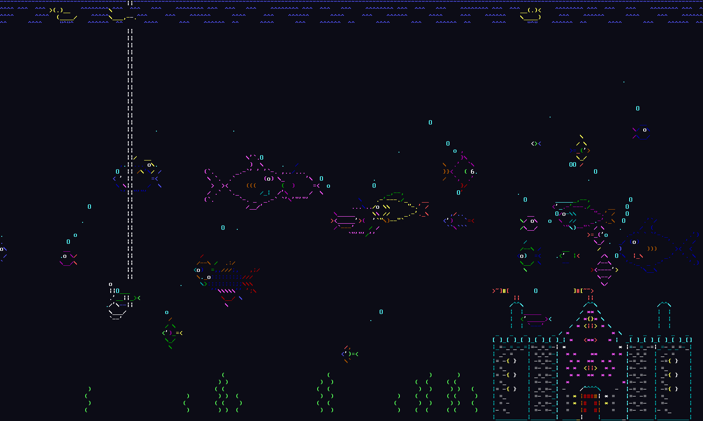
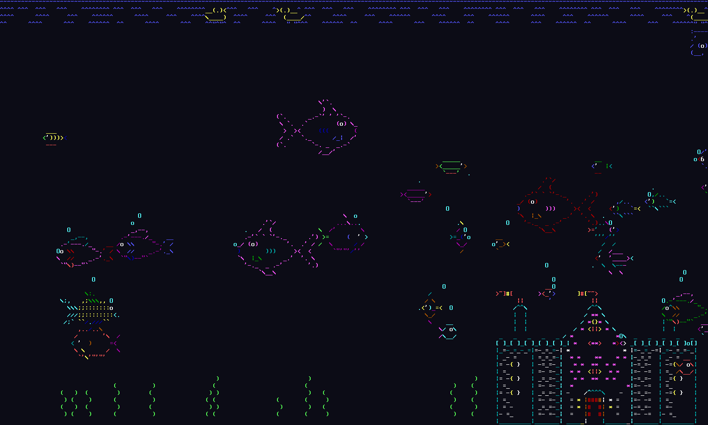

# ASCIIQuarium (Rust)

An aquarium animation in your terminal — colored ASCII fish, sharks, whales, sea monsters, and more, drifting across the screen while a castle watches from the corner. A Rust port of Kirk Baucom's classic [ASCIIQuarium](https://robobunny.com/projects/asciiquarium/html/).

## Screenshots







## Features

- Colorful small fish in a variety of species
- Sharks (with teeth that actually eat small fish)
- Whales with animated water spouts
- Loch Ness-style sea monsters
- Large fish, dolphins, and the occasional ship or submarine
- A descending fishing hook
- Ducks paddling across the surface
- Swaying seaweed and a castle on the seabed
- Rippling water surface
- Pause, speed up, slow down, and live terminal resize
- Optional `--image` flag to drop your own PNG/JPG into the scene as ASCII

## Installation

Requires a recent Rust toolchain (`rustup` recommended).

```bash
git clone https://github.com/sa3lej/asciiquarium.git
cd asciiquarium
cargo build --release
./target/release/asciiquarium
```

Or install the binary into your Cargo bin directory:

```bash
cargo install --path .
```

## Usage

```bash
asciiquarium                     # default animated aquarium
asciiquarium --classic           # classic-only entities (no Rust-port extras)
asciiquarium --image cat.png     # overlay a custom image as ASCII art
asciiquarium --image cat.png --image-size 60x30
```

Controls while running:

| Key | Action |
| --- | --- |
| `q` | Quit |
| `p` / `space` | Pause / resume |
| `+` / `=` | Speed up |
| `-` | Slow down |

Resizing the terminal restarts the scene cleanly.

## Credits

- Original [ASCIIQuarium](https://robobunny.com/projects/asciiquarium/) by **Kirk Baucom**
- Additional fish species ported from the Android version
- Rust port and extensions in this repository

## License

GPL — see [`gpl.txt`](gpl.txt).
